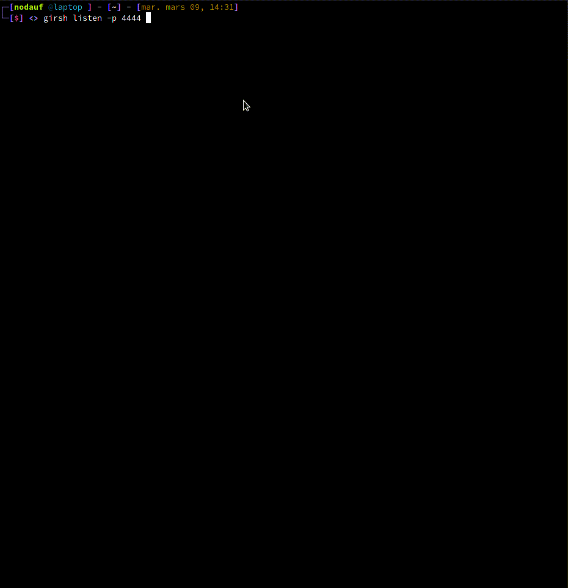
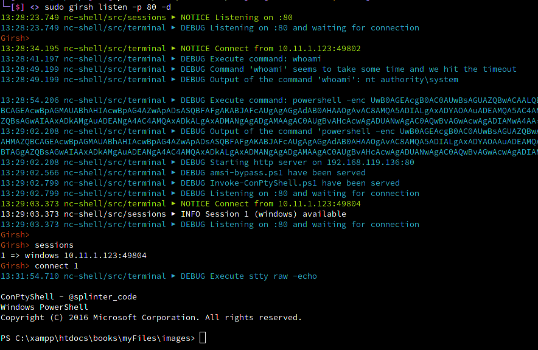

[](https://goreportcard.com/report/github.com/nodauf/Girsh)
# Girsh (Golang Interactive Reverse SHell)

Who didn't get bored of manually typing the few lines to upgrade a reverse shell to a full interactive reverse shell (tty spawn, stty size ..., stty raw -echo) or typing the command to use [ConPTY](https://github.com/antonioCoco/ConPtyShell).

## Description

With Girsh, just run it and it will detect the OS and execute the correct commands to upgrade it to a full interactive reverse shell.

For a Linux:
- Get the terminal's size
- Spawn a tty using python2.7, python3 and python
- Change the terminal as raw

For a Windows:
- Dowload [ConPTY](https://github.com/antonioCoco/ConPtyShell) on the same machine and same port as the reverse shell server
- Listen for getting the ConPTY reverse shell

## Usage

Two modes are available:

### Simple listener
```
go run main.go listener -h
Usage:
  girsh listen [flags]

Flags:
  -h, --help   help for listen

Global Flags:
  -d, --debug      Debug output
  -p, --port int   port to listen (default is 1234) (default 1234)
```

### Interactive
```
go run main.go -h
Generate a reverseshell oneliners (credits shellerator).
        And listen then run stty raw -echo and send the python command to spawn a tty shell if it's Linux
        or use ConPTY if it's windows

Usage:
  girsh [flags]
  girsh [command]

Available Commands:
  help        Help about any command
  listen      Listen and spawn a fully interactive for windows and linux client

Flags:
  -d, --debug      Debug output
  -h, --help       help for revshell
  -p, --port int   port to listen (default is 1234) (default 1234)
```

## Demo

### Linux

### Windows

